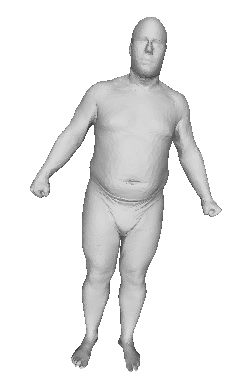
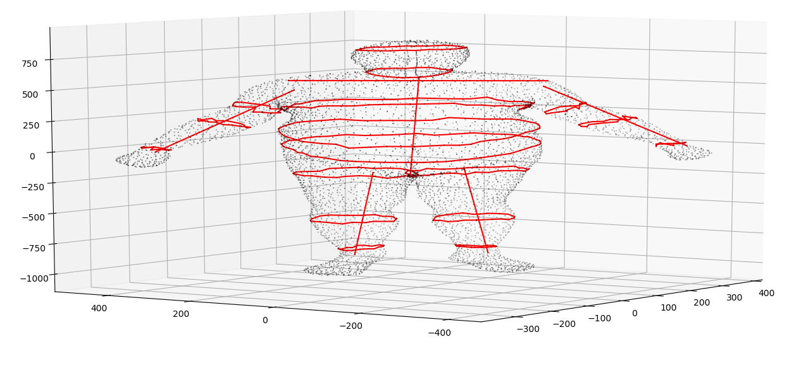
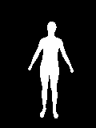

# Body Measurement Network
This repository contains source codes for the experiments in the following paper:

 * Song Yan, Johan Wirta, Joni-Kristian Kämäräinen (2020): "Silhouette Body Measurement Benchmarks" In review

If you use the code, data or even parts of them kindly cite our work.

 Running the code requires the following five steps:

 1. [Set up the environment](#set-up-the-environment)
 2. [Obtain 3D human body datasets](#obtain-3d-human-body-datasets)
 3. [Generate body measurements](#generate-body-measurements)
 4. [Generate silhouettes](#generate-silhouettes)
 5. [Train silhouette network](#train-silhouette-network)

 ## Set up the environment
All major parts are implemented in Python in Linux environment. The tested setup is Ubuntu 18.04 with Anaconda installed (https://www.anaconda.com/distribution/) . The following libraries are needed to run various pieces of the code:

 ```
 $ sudo apt-get install octave
 $ conda create --name humanbody_env
 $ conda activate humanbody_env
 $ conda install -c anaconda python=3.6
 $ conda install numpy
 $ conda install scipy
 $ pip install matplotlib
 $ pip install pywavefront
 $ pip install pyglet
 $ conda install tensorflow-gpu
 $ conda install keras
 $ conda install Pillow
  ```

## Obtain 3D human body datasets

<p align="center">
    
</p>

To train a silhouette network we need silhouette images and their corresponding body measurements. Real silhouette images and tape measured body measurements would be optimal, but since such datasets do not exist we need to generate as realistic datasets as possible.

In our case, both silhouette images and body measurements are generated using 3D body scans. There are two 3D body scan based datasets, CAESAR-fit (two different versions publicly available) and NOMO-fit (our data), and we explain the slightly different procedures for the both. Note that for training a big silhouette network neither of the datasets is large enough and therefore we synthetically expand them (data augmentation). Data augmentation is explained in the last part of this section.

 ### CAESAR-fit (Pishchulin et al. 2017)
CAESAR dataset is commercial and can be bought from [http://store.sae.org/caesar/](http://store.sae.org/caesar/). The dataset containts the original scans and tape measured ground truth for several thousand male and female subjects. CAESAR cannot be used in public evaluations due to its commercial license. However, kind folks from Max Planck Institut (Leonid Pischulin and his teammates) in Germany have fitted a 3D human shape model to a large portion of CAESAR scans and provide several versions of the fits on their project Web page [http://humanshape.mpi-inf.mpg.de/](http://humanshape.mpi-inf.mpg.de/). You should download the zipped dataset entitled ["CAESAR fitted meshes (607 MB)"](http://datasets.d2.mpi-inf.mpg.de/humanshape/caesar-fitted-meshes.zip).

  ```
  $ cd <DATADIR>
  $ wget http://datasets.d2.mpi-inf.mpg.de/humanshape/caesar-fitted-meshes.zip
  $ unzip caesar-fitted-meshes.zip
  ```
In the *caesar-fitted-meshes/* directory there are now Matlab mat-files (CSR1372A.mat etc.) that each contain
vertices of one fitted mesh - a matrix "points" that contains 6,449 3D points. If you want to check them, install
Octave (free Linux counterpart of Matlab) and plot one example using the plot3 function:
  ```
  $ octave
  >> load CSR1374A.mat
  >> plot3(points(:,1),points(:,2),points(:,3),'k.')
  ```
Note that MPII zip files do not provide much information - not even male/female tags - and therefore we have added our own:

 * List of male samples: [mpii_caesar_male_OBJ.txt](data/mpii_caesar_male_OBJ.txt) (Wavefront) [mpii_caesar_male_MAT.txt](data/mpii_caesar_male_MAT.txt) (Matlab)
 * List of female samples: [mpii_caesar_female_OBJ.txt](data/mpii_caesar_female_OBJ.txt) [mpii_caesar_female_MAT.txt](data/mpii_caesar_female_MAT.txt)

MPII CAESAR fit samples are ready to be used in the next step. They contain 6,449 vertices and 12,894 faces of the S-SCAPE  (Simple SCAPE) body mesh of (Jain et al. 2010). For more details about CAESAR-fit samples and how they are generated check the MPII Web site and read their paper (Pishchulin et al. 2017).

For network training you need to split the data to training and test samples. This can be by the following script:
  ```
  $ python body_meas_data_split.py -c config/caesar_simple_net.conf
  Training images written to TEMPWORK/mpii_caesar_male_MAT_TRAIN.txt
  Test images written to TEMPWORK/mpii_caesar_male_MAT_TEST.txt
  Done!
  $
  ```


### CAESAR-fit (Yang et al. 2014)
Yang et al. 2014 is quality-wise superior to Pishchulin et al. and also stored in the more convenient OBJ format instead of MAT Matlab files. It is easy to adapt our code to use their data that is available in their project [Web page](https://graphics.soe.ucsc.edu/data/BodyModels/).

### NOMO-fit (TO BE ADDED)
The main difference to CAESAR-fit dataset is that we need to fit a 3D body model to all scans first. After fitting the procedure is exactly the same as above.

### Generating more body data
Big networks require much more training samples than the current datasets provide. To solve this problem we generate synthetic samples according to the distribution of the dataset. At the moment this script is Octave/Matlab code. The following example is for Octave:

```
$ octave --no-gui
octave:1> body_meas_generate_3d_pca
temp_work = ./TEMPWORK
num_of_pca =  50
generate_num =  10000
verbose = 0
data_dir = caesar-fitted-meshes
data_file = TEMPWORK/mpii_caesar_male_MAT_TRAIN.txt
num_of_samples =  1745
  Read data 1745/1745 Done!
Computing PCA singular values and vectors... Done!
  Generating samples 10000/10000 Done!
All generated samples stored to ./TEMPWORK/mpii_caesar_male_MAT_TRAIN_GENERATED
 (see also ./TEMPWORK/mpii_caesar_male_MAT_TRAIN_GENERATED.txt)
octave:2> exit
```

The above example assumes CAESAR-fit by Pishchulin et al. and provides samples as MAT files using their format.
To get more synthetic samples, please edit the "generate_num" in *body_meas_generate_3d_pca.m* : line 4.

## Generate body measurements

<p align="center">
    
</p>

Ideally we would tape measure the subjects, but we can do almost the same by measuring surface paths on 3D body shapes. The following paths have been manually defined by us:

* S-SCAPE paths similar to (Dibra et al. 2017): [SCAPE-S_measurement_paths_Dibra.txt](./data/SCAPE-S_measurement_paths_Dibra.txt)

To produce the "virtual tape measurements" we need to go through all S-SCAPE samples (CAESAR fits and generated), compute the body measurements and store them for later use. This can be achieved by running the following code:

  ```
  $python body_meas_compute_measurements.py -c config/caesar_simple_net.conf
  ```
For plotting the shapes and measurement paths you may optionally run the code in debug mode, but this is slow:
  ```
  $python body_meas_compute_measurements.py -c config/caesar_simple_net.conf -d true
  ```
Body measurements are stored to the temporary working directory (TempDir in the config file) or to the same directory as the generated samples.

## Generate silhouettes

<p align="center">
    
</p>

Silhouette images are the input to a neural network regressor (SilhouetteNet or SilhouetteNet-Mini) while the body measurements from the previous step are the output (NNet(silhouette)->measurements). This step generates the silhouette binary images and stores in the PNG format.

  ```
  $ python body_meas_render_silhouettes.py -c config/caesar_simple_net.conf
  ```

The above generates silhouttes for the dataset meshes, but for the generated meshes you also need to run:

```
$ python body_meas_render_silhouettes.py -c config/caesar_simple_net.conf -g true
```

Silhouettes for the generated images are stored in the same directory as the generated 3D models (somewhere under the temporary working directory).

## Train silhouette network
To train a neural network you need to run (please edit the config files)

```
$ python body_meas_train_network.py -c config/caesar_simple_net.conf
```

However, the above assumes that the network is small and all data fits to memory which is unreasonable in most of the cases. For batch training run:

```
$ python body_meas_train_network.py -c config/caesar_simple_net.conf -g true
```

**Note:** Batch training works only with generated silhouettes as this is mainly when you need batch training.

### Test trained network

Simply type:

```
$ python body_meas_test_network.py -c config/caesar_simple_net.conf
```
This file outputs all tested body measurements, their average values and average mean absolute error of the tested network.

## References

1. Leonid Pishchulin, Stefanie Wuhrer, Thomas Helten, Christian Theobalt and Bernt Schiele (2017), [Building Statistical Shape Spaces for 3D Human Modeling](http://humanshape.mpi-inf.mpg.de/), Pattern Recognition.

2. Arjun Jain, Thorsten Thormahlen, Hans-Peter Seidel and Christian Theobalt (2010), [MovieReshape: Tracking and Reshaping of Humans in Videos](http://resources.mpi-inf.mpg.de/MovieReshape/), ACM Trans. Graph. (Proc. SIGGRAPH Asia).

3. Yipin Yang, Yao Yu, Yu Zhou, Sidan Du, James Davis, Ruigang Yang (2014), [Semantic Parametric Reshaping of Human Body Models](https://graphics.soe.ucsc.edu/data/BodyModels/), 3DV Workshop on Dynamic Shape Measurement and Analysis.

4. Endri Dibra, Himanshu Jain, Cengiz Oztireli, Remo Ziegler, Markus Gross (2017), [
Human Shape From Silhouettes Using Generative HKS Descriptors and Cross-Modal Neural Networks](http://openaccess.thecvf.com/content_cvpr_2017/papers/Dibra_Human_Shape_From_CVPR_2017_paper.pdf), IEEE Conf. on Computer Vision and Pattern Recognition (CVPR).
